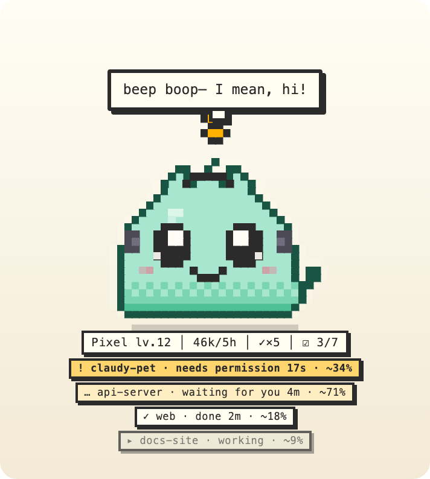
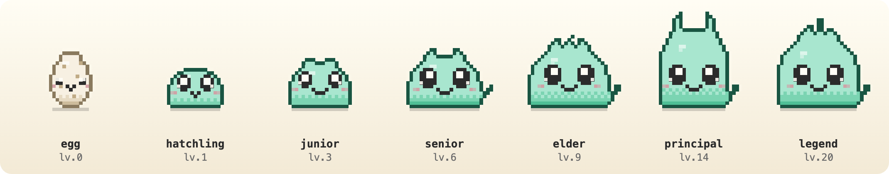
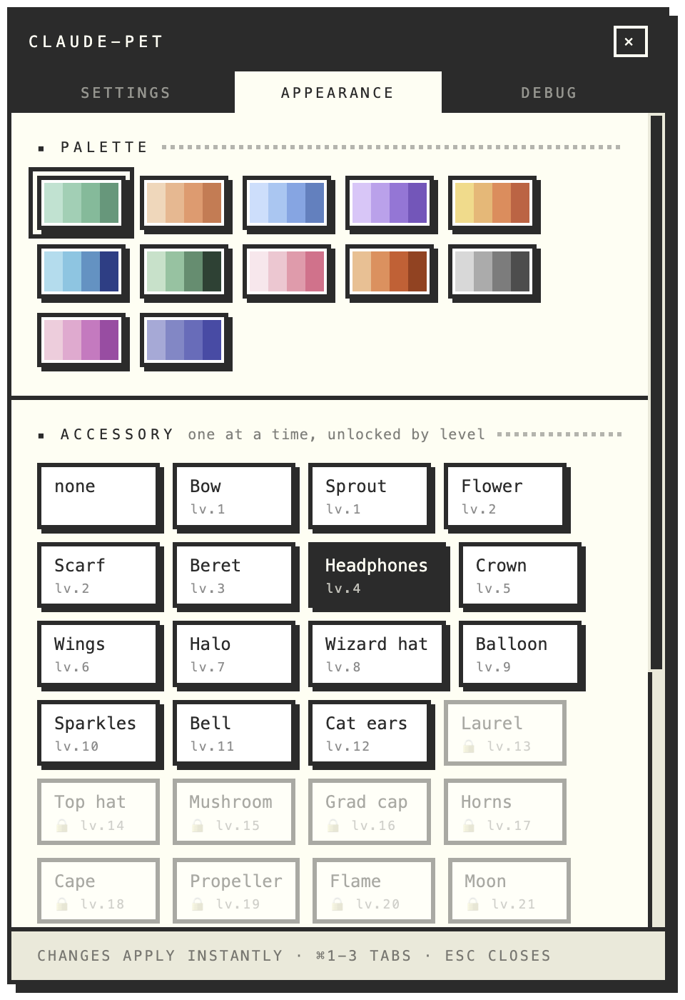
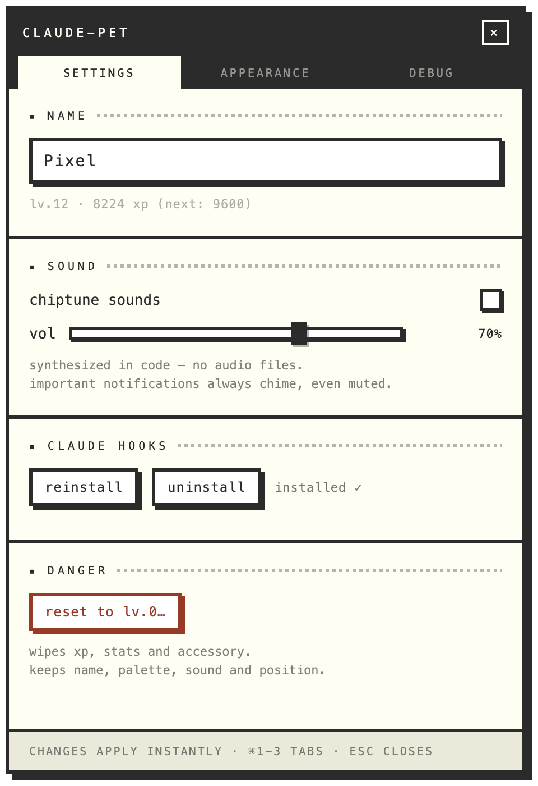

<div align="center">

# Gogu

**A desktop tamagotchi that feeds on your Claude Code sessions.**

It floats above your windows, eats the work you do, grows — and tells you
which terminal is waiting on you.

[](https://github.com/abaicus/gogu/releases/latest)
[](https://github.com/abaicus/gogu/releases/latest)
[](https://github.com/abaicus/gogu/actions/workflows/ci.yml)
[](LICENSE)



</div>

## Install

```sh
brew install --cask abaicus/tap/gogu
```

Or download the disk image from **[the latest
release](https://github.com/abaicus/gogu/releases/latest)** — `arm64` for Apple
Silicon, `x64` for Intel — and drag it to Applications. The build is
ad-hoc signed but not notarized by Apple, so a DMG install needs the quarantine
flag cleared once (the Homebrew cask does this for you):

```sh
xattr -dr com.apple.quarantine "/Applications/Gogu.app"
```

macOS 10.15+. Launch it and it does the rest: it installs its Claude Code hooks
and walks you through a four-step intro — what it is, what it just wrote to
your config, then name, colour, sound and size. Every control in the intro is
live, so there is nothing to apply and nothing to undo.

## Which terminal is waiting on you?

That is the real reason this exists. Four Claude sessions buried behind each
other all look identical from the outside, and the one blocked on a permission
prompt looks exactly like the one happily working.

So every live session gets its own line under the pet:

```
      Gogu lv.12 │ 46k/5h │ ✓×5 │ ☑ 3/7        ← the pet itself
  ! gogu · needs permission 17s · ~34%         ← amber: it cannot continue
  … api-server · waiting for you 4m · ~71%
  ✓ web · done 2m · ~18%                       ← your turn
  ▸ docs-site · working · ~9%                  ← needs nothing from you
```

Sorted by who is blocked on whom: what can't continue without you comes first,
what is happily working comes last. The pet **wears a `!`** for as long as any
session is actually blocked — not for the second the notification arrives, but
until that session moves again, because "I can't continue" has to survive the
moment you were looking somewhere else.

The `~%` is how full each session's context is, read from the transcript rather
than guessed. A context it hasn't read is *absent*, never `0%`.

The lines are on hover — a desktop pet that permanently wears a status bar is a
widget, so the numbers come up when you reach for them and drop away when you
leave.

## It grows on you



Levels 0–25 across seven forms, on xp from commits, green tests, PRs, deploys
and edits. Every form is a different **silhouette**, never a recolor. Every
level from 1 up unlocks something to wear — 27 accessories, one per level.

The ladder is append-only: the first eleven rungs are frozen, because
re-spacing them would silently demote every pet already standing on one.

Growing a new **silhouette** — seven times in a lifetime — gets a ceremony
rather than a bigger party: it crouches, sparks are pulled in from all sides,
it bleaches to a solid white shape, and what lands is the new creature. The
shape changes while the white is up, so you never see one form become another.

It can also get **ill**. Three red test runs with nothing green in between and
it puts a plaster on, stops wandering, and keeps it on — overnight, across
restarts — until a run comes back green. Curing it pays better than the red
run cost, so a bad afternoon ends better than even.

## Make it yours

<table>
<tr>
<td width="50%"></td>
<td width="50%"></td>
</tr>
<tr>
<td>12 palettes, 27 accessories, a size slider, and toggles for the speech
bubble, stats line and glow.</td>
<td>Name it, install or remove its hooks, and turn on chiptune sound —
synthesized in code, off by default.</td>
</tr>
</table>

Changes apply instantly; there is no Save button. `⌘1`–`⌘3` moves between tabs,
`esc` closes.

## What it notices

The hook payloads carry far more than "a tool ran", so the pet reads them:

- **The size of an edit.** A 70-line change is a *feast* (chomp animation,
  crumbs, extra food); a one-liner is a nibble. Editing a test file is its own
  small moment, and a known file extension gets a flavour ("rust!! crunchy").
- **What a bash command means** — commits, tests, PRs, deploys, releases,
  migrations, containers, linters, searches and the scary ones. First match
  wins, so the order *is* the semantics: `git commit --amend` is an amend,
  `git push --force` is a scare and not a push, `docker build` is docker and
  not a build. Commits and `git diff --stat` report the numbers *git printed*;
  a bare `git diff` reports none, because the output tail would undercount.
- **Claude's todo list.** A ticked box gets a nod, a finished list gets a spin
  and a jingle, and progress shows in the stats line while it's still live.
- **Subagents**, announced going out (`*Explore, go!*`) and coming back.
- **Which host** a WebFetch read, **which MCP server** a call went to.
- **Permission-mode changes** — plan mode, auto-edit, and `bypassPermissions`,
  which gets an important bubble and a shiver. The value is never announced,
  only the change.
- **Session shape**: resume vs clear vs startup, manual vs auto compaction,
  and a permission prompt vs Claude idly waiting on you (different chimes).
- **Whose move it is.** Every event moves its session's status: a tool call or
  a prompt means *working*, a permission Notification means *blocked on you*,
  an idle one means *waiting*, and `Stop` means the turn ended and it's your
  keyboard. `SubagentStop` deliberately does not — a helper finishing is not
  the turn finishing, and saying so would be a lie about whose move it is.

## What it records about you

It watches your sessions, so this matters more than the rest of the README:

- It records the **length** of your prompt and **not one character of its
  text**.
- Everything it keeps lives in `~/.gogu/` as human-readable JSON. Nothing is
  sent anywhere — there is no network code in this app.
- The hook script is fire-and-forget: it appends one line and exits, and it
  can never block, slow or fail a Claude session.
- Installing hooks appends to `~/.claude/settings.json` and preserves the rest
  of your config. It refuses to touch a config it can't parse, and
  **uninstalling removes exactly its own entries** — from the tray, or the
  settings window.

It also never lies about what it read: estimates are labeled `~`, and data it
can't read is left out rather than faked.

## Living with it

- **Left-click** to pet it (~45% of the time it answers with a real fact about
  your session). **Double-click** for a cookie.
- **Click a session line** and the terminal running that session comes to the
  front — iTerm2 and Terminal.app, matched on the session's own working
  directory. The line that says which terminal needs you is also the way there.
- **Drag** it anywhere and the position sticks — set it down gently and it
  stays exactly there, at any height, including the top of the screen.
- **Throw** it and physics takes over: let go while your hand is still moving
  and it falls, bounces off the floor, the walls and the ceiling, and squashes
  on landing. Speed is what decides, not height, so placing is never a drop.
  Turn `gravity` off in settings or the intro to disable throwing entirely.
- **Right-click** or use the **tray icon** for settings, a treat, hide/show,
  sounds, click-through, hooks, today's receipt, the pet card and quit.
- **Today's receipt** — the menu shows the day's line (`3 commits · 41 edits ·
  774 xp`) and opens the whole till roll: every prompt, edit, feast, commit and
  test run, priced in xp, subtotalled and balanced. Copyable as text.
- **Pet card** — a portrait and the lifetime figures as a PNG, drawn on a
  canvas rather than screenshotted, saved to the desktop or copied.
- **Global shortcuts** — real ones, registered with the OS:

  | | | |
  |---|---|---|
  | `⌘⌥,` settings | `⌘⌥T` treat | `⌘⌥V` hide/show |
  | `⌘⌥M` sounds | `⌘⌥P` click-through | `⌘⌥Q` quit |

  `⌘⌥P` is the escape hatch: a click-through pet can't offer its own way back.

Every sprite is pixel art drawn on an integer grid at runtime — no image files
anywhere in the app, including its own icon. It is never quite still: it
breathes, blinks, glances around, and fidgets every few seconds.

### A noise it can't explain is a bug

Every chime comes with words. A reaction says its own line if it has one — and
where the payload names the thing, that name is what gets said, every time
(`*reads reducer.js*`, `*pokes the Sanity server*`, `*list the project files*`
straight from Claude's own description of the command). Where it doesn't, the
sound itself supplies the words: each of the 55 motifs is mapped to a phrase
pool, and the brain speaks from it whenever a reaction chirped and nothing
more specific was said. Otherwise you hear a blip, look up, and have no way of
finding out what the pet just noticed. One test walks the motif table to prove
no sound can play in silence.

### Where the context number comes from

The numerator is read, never guessed: the newest main-chain assistant turn in
the transcript carries `input + cache_read + cache_creation`, and when a
session is compacted Claude Code writes its own before/after counts into a
`compact_boundary` entry, so the readout drops the moment the context does.
Subagent turns are excluded — they make it bounce.

The denominator is the one thing the transcript never states, so it comes from
three sources, best first: a ceiling **measured** at an auto-compaction (it
fired *at* the limit, so that number is the limit, and it is persisted); a
per-model table; or, if a reading comes in bigger than the table allows, the
reading itself. That last rule exists because a flat 200k assumption once had
the pet cheerfully announcing `ctx ~180%`.

Context warnings fire once at ~75% and ~90% per session, and re-arm below 60%.

## Uninstall

```sh
brew uninstall --cask gogu                # or drag the app to the Trash
```

Remove its hooks first (tray → *uninstall hooks*, or the settings window) if
you want your `~/.claude/settings.json` cleaned up — the app only ever removes
its own entries. `brew uninstall --zap --cask gogu` also deletes `~/.gogu`;
it deliberately leaves your Claude config alone.

## Development

```sh
npm install
npm start                                 # run from source

npm test                                  # headless brain tests (node:test)
npm run dist                              # DMG + ZIP for both arches → dist/
npm run icon                              # redraw build/icon.icns from art.js
npm run shots                             # re-render the README screenshots
npm run shots:gif                         # record the pet reacting → an animated GIF
npx electron scripts/shoot-mockups.js     # render art mockups to mockups/*.png
```

Releases (GitHub release + Homebrew cask, from one workflow run) are described
in [docs/releasing.md](docs/releasing.md).

**Showing it to a room.** Settings → DEBUG → *play the reel* runs a scripted
day at speed: it eats, sulks, falls ill, recovers, ships, and evolves three
times, in about forty seconds. Every beat goes through the real reducer, so
what the room sees is the app reacting rather than a second animation system
posing for the camera. The reel *borrows* the pet — whatever it was before is
put back at the end — so it can be run again before the next meeting, and no
real xp is earned or lost.

Sandboxing for development — never touches your real config:

```sh
GOGU_DIR=/tmp/pet-sandbox \
GOGU_SETTINGS=/tmp/pet-sandbox/settings.json \
npm start
```

Debug env: `GOGU_NO_HOOKS=1` (skip hook install), and for screenshots
`GOGU_SHOT=/path.png` / `GOGU_SHOT_SETTINGS=/path.png` with
`GOGU_SHOT_DELAY=ms`, `GOGU_SHOT_HOVER=1` (raise the stats line) and
`GOGU_SHOT_TAB=appearance`. `GOGU_SHOT_FRAMES=n` with
`GOGU_SHOT_EVERY=ms` turns the shot into a numbered burst — that is how
`shots:gif` records a reaction, by appending events to the sandbox's
`events.jsonl` on a timeline while the app photographs itself (needs `ffmpeg`).

Every screenshot in this README is generated by `npm run shots`, which seeds a
sandbox with the same `events.jsonl` the hooks write and the same transcripts
Claude Code leaves behind, then lets the app photograph itself. Nothing here is
mocked up — if a number in a screenshot is wrong, the app is wrong.

### Architecture

Three strictly separated layers (deleting the renderer leaves the brain
fully functional):

```
src/
  capture/    hook script (standalone, zero deps) + settings installer
  brain/      ALL state & game logic — no Electron imports, headless-testable
              tailer (byte-offset cursor) · reducer (event → state) ·
              bash-parser (command semantics) · sessions (transcript
              telemetry) · quips · persistence · ledger (the day, counted) ·
              receipt (the day, printed) · demo (the reel)
  body/       dumb renderer: render(state) — canvas art, animations,
              bubble, stats line, sounds (all generated in code)
  chrome/     window-side logic worth testing: physics (the fall),
              focus (finding the terminal a session is running in)
  settings/   remote control only; the brain enforces every rule
  onboarding/ the first-launch intro — same, plus a live portrait of the pet
  receipt/    a printer: it asks the brain for today's lines and shows them
  card/       the shareable PNG, drawn on a canvas with the real PetArt
  shared/     constants, tuning, IPC channel names
```

State lives in `~/.gogu/` as human-readable versioned JSON (`state.json`
progression · `prefs.json` customization · `cursor.json` read offsets). Players may cheat; that's a feature.

## License

[MIT](LICENSE)
